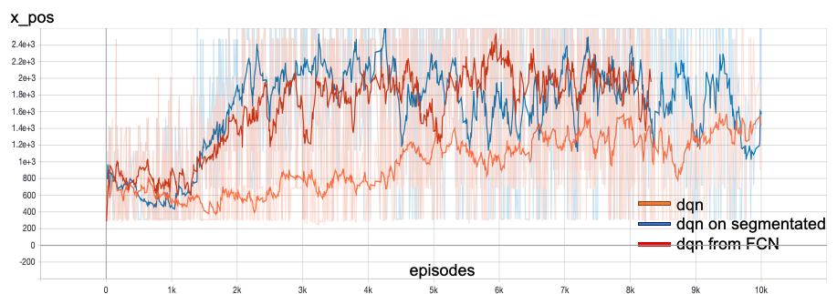

# reinforced-mario

This project was done for the course COMP767 (Reinforcement Learning), given at McGill in Winter 2020 and given by Doina Precup.

It was made by Mathieu Beligon (mathieu.beligon@mail.mcgill.ca; ID: 260983485), in April 2020.

## Installation

1. **python37** (or compatible) is required.

2. To install the dependencies, please run:

    ```bash
    pip install -r requirements.txt
    ```

3. Add the src folder to the PYTHONPATH.

    You can either add it for the whole terminal session:
    ```bash
   export PYTHONPATH=$PYTHONPATH:src
    ```
   
   Or, when running a script:
   
   ```bash
   PYTHONPATH=src python src/scripts/00_evaluate_random.py
   ```
   
4. The pre-trained DQN agent obtained through transfer learning was too large to fit on GitHub. You can download it on [Google Drive](https://drive.google.com/open?id=1yooe_lz8ev8mPgfIwhqz9PsqnX5kKk-o). Unzip the file, and put the `dqn-from-fcn__f16-k3_s2__f32-k3_f32-k3_s2__d8-with-conv` directory in [exp/rl](exp/rl), along with the other models.
   
   
All the data needed is included in this repo, along with pre-trained models.


## Scripts

All scripts are gathered in the [src/scripts](src/scripts) folder.

 - [00_evaluate_random.py](src/scripts/00_evaluate_random.py): This scripts serves as a baseline to evaluate the performance of a random agent.
 - [fcn](src/scripts/fcn): The scripts related to image segmentation training are gathered here:
   - [01_train_custom_models.py](src/scripts/fcn/01_train_custom_models.py): Use this script to train a new FCN model, on the architecture of your choice. Beware that it will overwrite an existing FCN with the same architecture. 
   - [02_evaluate_models.py](src/scripts/fcn/02_evaluate_models.py): This script can be used to evaluate and compare the performance of the models.
 - [rl](src/scripts/rl) contains the scripts to train the 3 agents, along with a script to watch pre-trained models play. The training can be long (from 10 hours to 2.5 days), and overwrite existing models and logs. When training the models, you can edit the file [display.yml](display.yml), to see the agent that is trained. It slows down the training a little though.
 
 
## Pre-trained models

Except for the larger DQN model obtained through transfer learning, pre-trained models, along with logs of training, are included in the [exp](exp) folder.

## Results

### FCN segmentation

Below are the results achieved by the best FCN architectures I trained, on 84*84 pixels colored images:

| architecture | accuracy | FPS |
|----------|:-------------:|------:|
|fcn__f32-k3_f32-k3_s2__f64-k3_f64-k3_s2__d8| 99.33% | 14.1 |
|fcn__f32-k3_s2__f64-k3_f64-k3_s2__d8| 99.19% | 15.5 |
|fcn__f16-k3_s2__f32-k3_f32-k3_s2__d8| 99.21% | 32.6 |

To visualise the logs, please run

```bash
tensorboard --logdir=./exp/segmentation
```


### Agents



To visualize the training graphs, please run

```bash
tensorboard --logdir=./exp/rl
```

## Report

The report for this project can be found [here](report/report.pdf).
